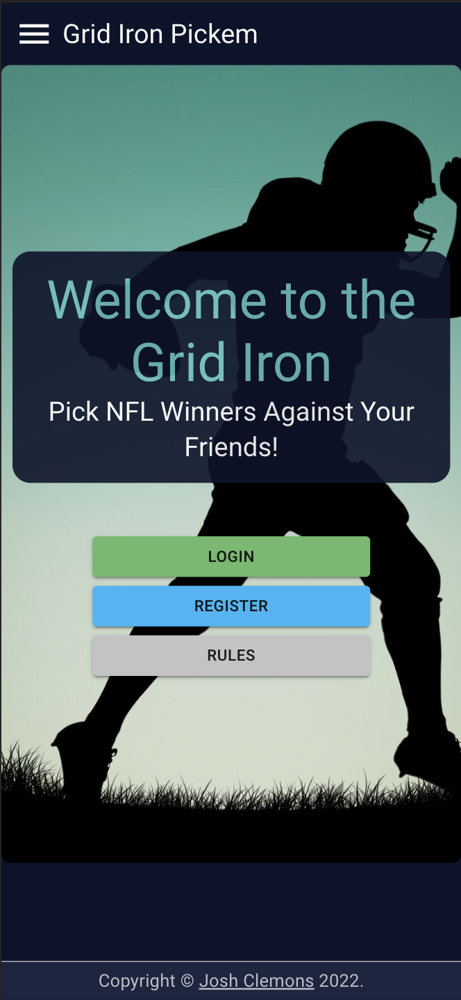
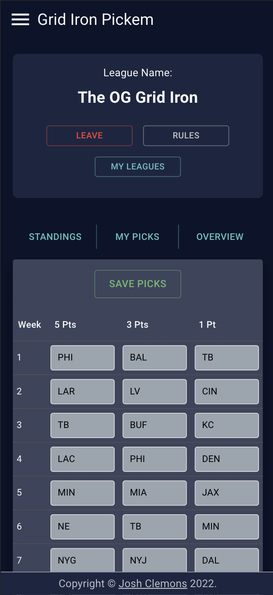

# Grid Iron Pickem

## Description

Grid Iron Pickem is a season long game where you can compete against your friends in picking NFL teams to win. Users choose their picks each week according to the rules posted on the site. Scores are tracked and automatically calculated against data from ESPN, making managing the league very easy.

To see the fully functional site, please visit: [DEPLOYED VERSION OF APP](www.heroku.com)

## Screen Shot

### Prerequisites

- [Node.js](https://nodejs.org/en/)
- [Postgresql](https://www.postgresql.org/download/)

## Installation

How do you get your application up and running? This is a step by step list for how another developer could get this project up and running. The good target audience in terms of knowledge, would be a fellow Primer from another cohort being able to spin up this project. Note that you do not need a paragraph here to intro Installation. It should be step-by-step.

If your application has secret keys (for example --  Twilio), make sure you tell them how to set that up, both in getting the key and then what to call it in the `.env` file.

1. Create a database named `grid_iron`,
2. The queries in the `database.sql` file are set up to create all the necessary tables. The project is built on [Postgres](https://www.postgresql.org/download/), so you will need to make sure to have that installed. We recommend using Postico to run those queries as that was used to create the queries, 
3. Open up your editor of choice and run an `npm install`
4. Run `npm run build:dev` in your terminal
5. Run `npm run start:dev` in your terminal
6. Then navigate to `http://localhost:3000/` in your web browser

## Usage

1. Register new account or sign in
2. Join someone else's league or create a new one
3. Make your picks and save them every week
4. View league standings and an overview of picks in the league details page
5. Rename, Leave, or delete a league if it is not needed

## Built With

- TypeScript
- Node.js
- Express
- React
- Redux
- Material UI
- Passport
- ...and many more

## Acknowledgement

A special thanks to the VETTEC program for allowing me to attend  [Prime Digital Academy](www.primeacademy.io). Faculty and students have all been amazing in helping to make this project a reality.